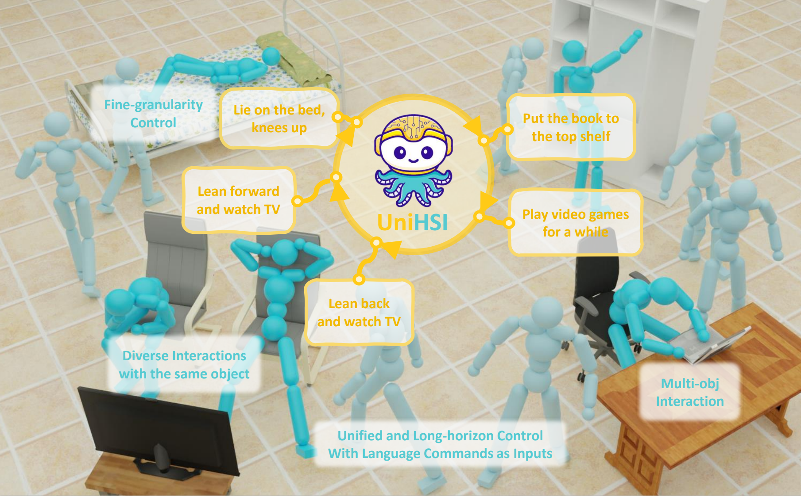
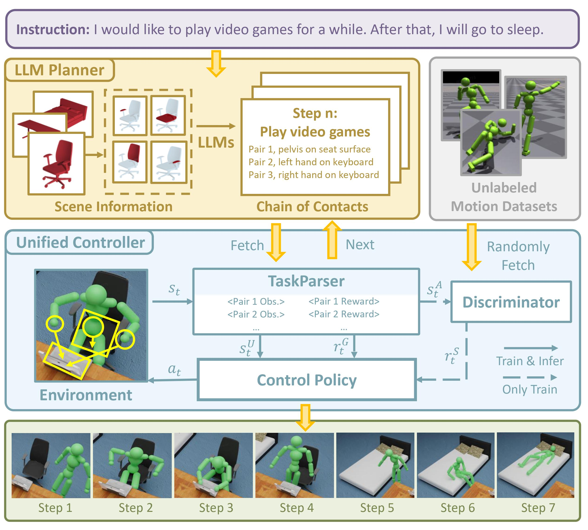

<br>
<p align="center">
<h1 align="center"><strong>Unified Human-Scene Interaction 
  via Prompted Chain-of-Contacts</strong></h1>
  <p align="center">
    <a href='https://github.com/xizaoqu/' target='_blank'>Zeqi Xiao</a>&emsp;
    <a href='https://tai-wang.github.io/' target='_blank'>Tai Wang</a>&emsp;
    <a href='https://scholar.google.com/citations?user=GStTsxAAAAAJ&hl=zh-CN&oi=ao/' target='_blank'>Jingbo Wang</a>&emsp;
    <a href='https://www.jinkuncao.com/' target='_blank'>Jinkun Cao</a>&emsp;
    <a href='http://zhangwenwei.cn/' target='_blank'>Wenwei Zhang</a>&emsp;
    <a href='https://daibo.info/' target='_blank'>Bo Dai</a>&emsp;
    <a href='http://dahua.site/' target='_blank'>Dahua Lin</a>&emsp;
    <a href='https://oceanpang.github.io/' target='_blank'>Jiangmiao Pang*</a>&emsp;
    <br>
    Shanghai AI Laboratory&emsp;Nanyang Technological University&emsp;Carnegie Mellon University
  </p>
</p>

<p align="center">
  <a href="https://arxiv.org/abs/2309.07918" target='_blank'>
    
  </a> 
  <a href="./assets/UniHSI.pdf" target='_blank'>
    
  </a> 
  <a href="https://xizaoqu.github.io/unihsi" target='_blank'>
    
  </a>
</p>

## 🏠 About
<!--  -->
<div style="text-align: center;">
    
</div>
This paper presents <b>a UNIfied HSI framework, UniHSI, which supports unified control of diverse interactions through language commands</b>. This framework is built upon the definition of interaction as <b>Chain of Contacts</b> (CoC): steps of human joint-object part pairs, which is inspired by the strong correlation between interaction types and human-object contact regions.
Based on the definition, UniHSI constitutes a <b>Large Language Model (LLM) Planner</b> to translate language prompts into task plans in the form of CoC, and a <b>Unified Controller</b> that turns CoC into uniform task execution. To facilitate training and evaluation, we collect a new dataset named <b>ScenePlan</b> that encompasses thousands of task plans generated by LLMs based on diverse scenarios. Comprehensive experiments demonstrate the effectiveness of our framework in versatile task execution and generalizability to real scanned scenes.

## 🔥 News
- [2024-04] The data is released.
- [2024-03] The code is released.
- [2024-01] UniHSI is accepted as ICLR 2024 spotlight. Thanks for the recognition!
- [2023-09] We release the [paper](https://arxiv.org/abs/2309.07918) of UniHSI. Please check the :point_right: [webpage](https://xizaoqu.github.io/unihsi) :point_left: and view our demos! :sparkler:;

## 🔍 Overview
<p align="center">
  
</p>
The whole pipeline consists of two major components: the LLM Planner and the Unified Controller. The LLM planner takes language inputs and background scenario information as inputs and outputs multi-step plan in the form of a Chain of Contacts. The Unified Controller then executes task plans step-by-step and output interaction movements.


## Installation

Download Isaac Gym from the [website](https://developer.nvidia.com/isaac-gym), then
follow the installation instructions.

Once Isaac Gym is installed, install the external dependencies for this repo:

```
pip install -r requirements.txt
```

## Data Preparation

#### PartNet

1. Download [PartNet](https://partnet.cs.stanford.edu/) and [ShapeNet V2](https://huggingface.co/datasets/ShapeNet/ShapeNetCore-archive/tree/main).

2. Save them in the following formation
```
data/
├── partnet_origin
│   ├── obj_id1
│   ├── obj_id2
│   ├── ...
├── shapenet_origin
│   ├── class_id1
│   │    ├── obj_id1
│   │    ├── ...
│   ├── class_id2
│   │    ├── obj_id1
│   │    ├── ...
│   ├── ...
```

3. Extract the objects used in sceneplan by
```
python cp_partnet_train.py
python cp_partnet_test.py
```

#### ScanNet

1. Download [ScanNet](http://www.scan-net.org/).

2. Save them in the following formation
```
data/
├── scan_origin
│   ├── scans
│   │   ├── scans_1
│   │   ├── scans_2
│   │   ├── ...
```

3. Extract the objects used in sceneplan by
```
python cp_scannet_test.py
```

#### Motio Clips

We select and process motion clips from [SAMP](https://github.com/mohamedhassanmus/SAMP) and [CIRCLE](https://stanford-tml.github.io/circle_dataset).

## Training

We adopt step-by-step training.

```
sh train_partnet_simple.sh
sh train_partnet_mid.sh
sh train_partnet_hard.sh
```

## Demo

```
sh demo_scannet.sh
```


## 🔗 Citation

If you find our work helpful, please cite:

```bibtex
@inproceedings{
  xiao2024unified,
  title={Unified Human-Scene Interaction via Prompted Chain-of-Contacts},
  author={Zeqi Xiao and Tai Wang and Jingbo Wang and Jinkun Cao and Wenwei Zhang and Bo Dai and Dahua Lin and Jiangmiao Pang},
  booktitle={The Twelfth International Conference on Learning Representations},
  year={2024},
  url={https://openreview.net/forum?id=1vCnDyQkjg}
}
```

## 📄 License
<a rel="license" href="http://creativecommons.org/licenses/by-nc-sa/4.0/"></a>
<br />
This work is under the <a rel="license" href="http://creativecommons.org/licenses/by-nc-sa/4.0/">Creative Commons Attribution-NonCommercial-ShareAlike 4.0 International License</a>.

## 👏 Acknowledgements
- [ASE](https://github.com/nv-tlabs/ASE): Our codebase is built upon the AMP implementation in ASE.
- [PartNet](https://partnet.cs.stanford.edu/) and [ShapeNet](https://huggingface.co/datasets/ShapeNet/ShapeNetCore-archive/tree/main).: We use objects from PartNet for training and evaluation.
- [ScanNet](http://www.scan-net.org/): We use scenarios from ScanNet for evaluation.
- [SAMP](https://github.com/mohamedhassanmus/SAMP): We use motion clips from SAMP for training.
- [CIRCLE](https://stanford-tml.github.io/circle_dataset): We use motion clips from CIRCLE for training.
